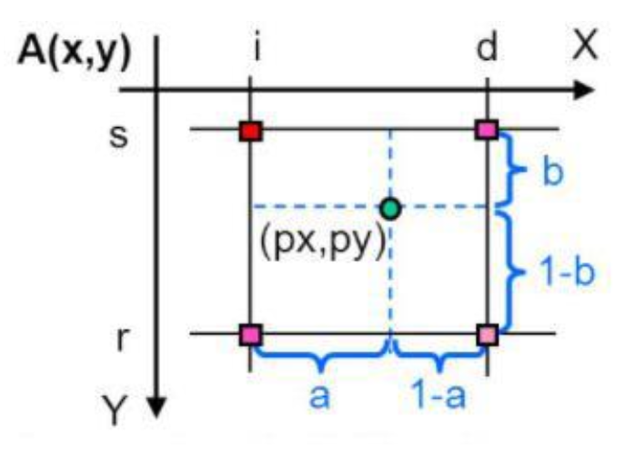
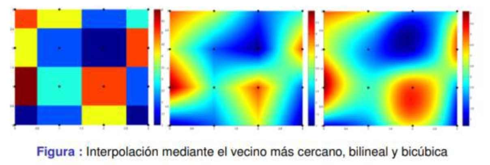
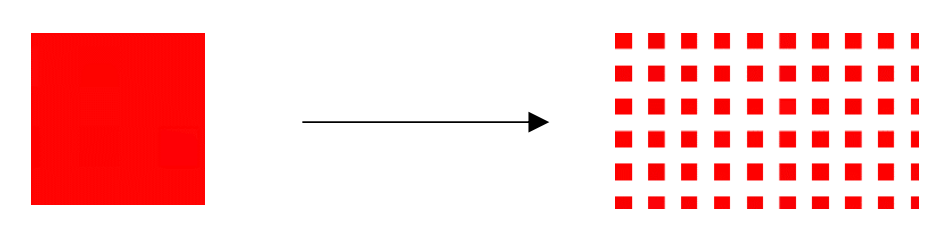
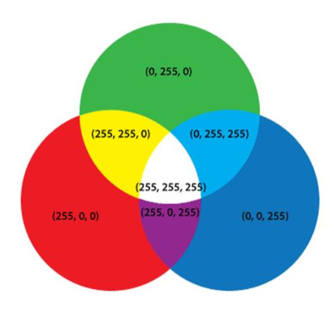
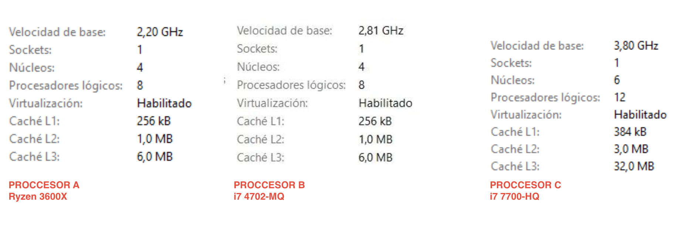
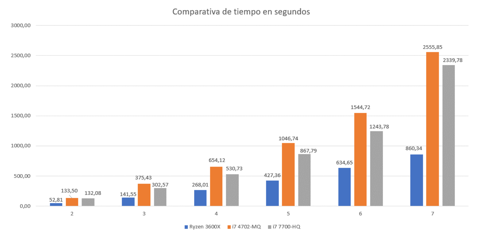
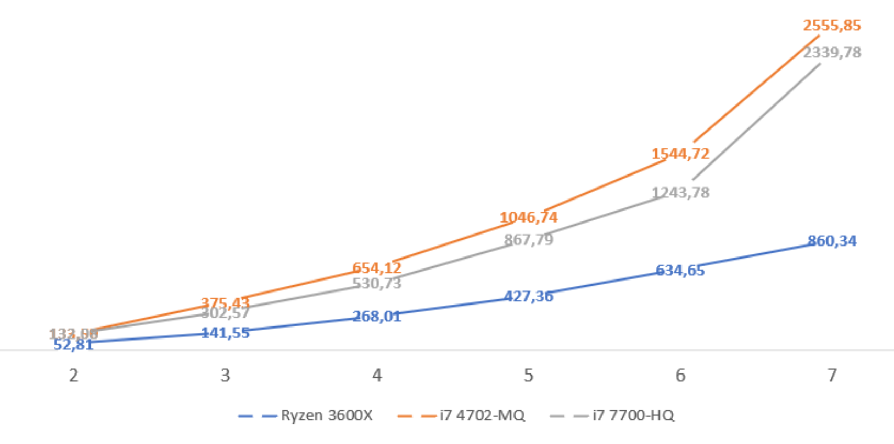
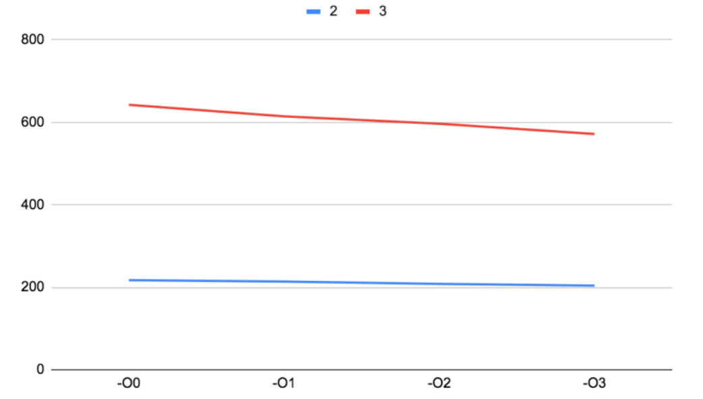

# BICUBIC INTERPOLATION

A cross-platform C++ implementation of bicubic interpolation for image scaling using the CImg library.

## Features

- ✨ High-quality image upscaling using bicubic interpolation
- 🎨 Full RGBA support (preserves transparency)
- 🖥️ Cross-platform: macOS and Linux
- ⚡ Fast performance with algorithms
- 📦 Single-header library (CImg)

## Algorithm Workflow

1. Load source image (`input-image.png`)
2. Create destination image with scaled dimensions
3. Copy original pixels to scaled positions
4. Interpolate missing pixels using 4x4 neighborhoods (bicubic interpolation)
5. Save result as `output-image.png`

## Quick Start

### Installation

See [INSTALL.md](INSTALL.md) for detailed platform-specific installation instructions.

## Bicubic Interpolation: Deep Dive

One of the most important operations that can be performed in image processing is image scaling. Image scaling consists of enlarging or reducing the physical size of an image by changing the number of pixels it contains. It modifies the size of the image content and resizes the canvas accordingly.

There are three main algorithms used to perform this task: nearest neighbor, bilinear interpolation, and the one we will focus on, bicubic interpolation.

To better understand this image interpolation method, we will first explain the other two for clarity. Nearest neighbor is a basic method that requires low processing time. It only considers a single pixel—the one closest to the interpolated point. Essentially, it simply increases the size of each pixel.

Bilinear interpolation takes into account the values of the known pixels surrounding a given one within a neighborhood of the closest 2×2 pixels. Once these values are obtained, a weighted average of the four pixels is computed to determine the interpolated value. The result is smoother than with the previous method due to the averaging process, although this comes at the cost of increased processing time.


Going one step beyond the bilinear case, bicubic interpolation considers the neighborhood of the closest 4×4 known pixels, that is, a total of 16 pixels. Since these pixels are located at different distances from the unknown pixel, greater weight is assigned to those that are closer during the calculation. This method produces sharper images than the previous two. It represents a good compromise between processing time (as it has the highest computational load) and output quality. It is a standard procedure in image editing software, printer drivers, and camera interpolation.



### What is Bicubic Interpolation?

Bicubic interpolation is a high-quality image resampling method that uses the values of the 16 nearest pixels (a 4x4 grid) to estimate the value of a new pixel. It produces much smoother and sharper results than nearest-neighbor or bilinear interpolation.



- **Nearest neighbor**: Uses 1 pixel (blocky results)
- **Bilinear**: Uses 4 pixels (2x2 grid, linear blend)
- **Bicubic**: Uses 16 pixels (4x4 grid, cubic blend in both directions)

### How it works

Thanks to the different data structures provided by the CImg library, we store the image _“input-image.png”_ that is present in the repository at that moment, which will be the image to which we apply the transformations based on bicubic interpolation.

Next, we also initialize another set of key values required for the correct functioning of the algorithm: **scaleFactor** (an integer or decimal value by which the image will be scaled; that is, if an image is initially 100×100 pixels and the scaleFactor is set to 5, the resulting image will be 500×500 pixels), **width** (the width of the original image), and **height** (the height of the image expressed in pixels).

After this, we initialize the resulting image, where the scaling follows the previously explained approach, and we enter the first loop of the program. In this loop, we only insert the RGB values of the pixels that are already known, in the following manner:



Initially, we have an image for which all pixel values are known (red squares). When we enlarge it, for example using a scaling factor of 2, the number of pixels increases, leaving positions for which the RGB value is unknown (white squares). However, since we know the original values, we can redistribute them throughout the new image so that we only need to fill in half of the pixels using bicubic interpolation.

> [!NOTE]  
> Highlights information that users should take into account, even when skimming.
> As a side note, it is worth highlighting how the library accesses and inserts RGB values. In the call `imgX(x, y, 0, RGB)`, **x** and **y** refer to the coordinates of the matrix to be used. The next argument of the function is the image depth (which is irrelevant in this assignment and will always be set to 0), and finally the color channel to be considered, **RGB**, which can take three values: 0 (red), 1 (green), and 2 (blue), since a color is composed of the combination of these values.
> 

Continuing with the implementation of `main()`, we now reach its core component: the loop responsible for invoking the generation of the 4×4 RGB matrices, since these are the pixels required by bicubic interpolation to compute a weighted average.

This process must be carried out for each color channel. The matrix resulting from this procedure will be similar to:

<pre>
| 255 | 165 |  43 | 234 |
| 211 | 234 |  34 | 249 |
|  32 |  34 | 123 |  94 |
|  12 | 129 | 123 |  87 |
</pre>

As can be observed in the source code, there are two intermediate functions that are used to assign values to pixels that are not original: `getNeighborhood()` and `bicubicInterpolate()`.

Focusing on `getNeighborhood()`, this function is responsible for finding all the coordinates of the 16 neighboring pixels that form the surrounding area of the original image. Depending on the color channel to be constructed (red, green, blue, or alpha), it extracts different values using the `channel` argument.

The function iterates over 4 columns and, for each, 4 rows (the typical traversal loop for two-dimensional matrices):

```cpp
for (int x = 0; x < 4; x++) {
  for (int y = 0; y < 4; y++) {
    // ... compute pixelX, pixelY ...
    colorMatrix[x][y] = (double)src(pixelX, pixelY, 0, channel);
  }
}
```

Based on the coordinates of the pixel to fill, the function computes the region in which it is located, allowing all the positions of the matrix to be filled so that it can be returned by reference and later analyzed by the auxiliary functions.

Regarding the auxiliary functions responsible for mathematically reinterpreting the matrices in order to obtain a weighted contribution of the 16 adjacent pixels, they are implemented as follows:

```cpp
double cubicInterpolate(double p[4], double x) { /* ... */ }
double bicubicInterpolate(double p[4][4], double x, double y) { /* ... */ }
```

These functions apply the Catmull-Rom spline and bicubic interpolation, as described earlier.

In conclusion, we take the matrix mentioned at the beginning of this section, which contains the original pixels redistributed throughout the new image, and fill in the values at the unknown coordinates. This results in a rescaled image in which a loss of quality is barely noticeable thanks to the scaling algorithm used. In this example, the black pixels correspond to those that should be modified by the program.

## Performance Analysis

Historical performance comparison using 512x512 pixel images across different processors:





Performance observations from older processors:

- **Ryzen 3600x**: Linear time increase, fastest overall performance
- **i7 7700MQ**: Exponential time increase, tests only up to 7x scale
- **i7 4702MQ**: Slowest, entirely exponential growth



# Results

Notice how the upscaled image preserves details and smoothness, showcasing the strength of bicubic interpolation over simpler methods.

|           Original (20px)           |        Upscaled (336px) [x16]         |
| :---------------------------------: | :-----------------------------------: |
|  |  |

### Compilation Parameters

#### -Ox Type Parameters

The default optimization level of GCC is -O0. According to the GCC manual: “When no optimization option is specified, the compiler’s goal is to reduce compilation time and make debugging produce the expected results.” Therefore, the code will not be optimized.

The most basic optimization level is -O1. With this option, the compiler attempts to produce fast and compact code without significantly increasing compilation time. It is basic, but it performs the task correctly.

Next is -O2, which is the recommended optimization level unless the system has special requirements. -O2 enables additional options beyond those activated with -O1. With -O2, the compiler attempts to increase code performance without compromising size and without taking much more compilation time.

Finally, -O3 is the highest possible optimization level. It enables optimizations that are expensive in terms of compilation time and memory usage. However, compiling with -O3 does not guarantee improved performance; in some cases, it may slow down a system due to the use of large binaries and high memory consumption.

#### -march Parameter

The -march parameter specifies which code should be generated for a given processor architecture. Different CPUs have different characteristics, support different instruction sets, and execute code in different ways.

If the CPU type cannot be determined or if the user does not know which settings to choose, the option -march=native can be used. When using it, GCC attempts to detect the processor and automatically applies the appropriate options.

#### -Ofast Parameter

The -Ofast parameter enables all optimizations from -O3 as well as additional optimizations that are not valid for all standards-compliant programs.

#### -floop-parallelize-all Parameter

The -floop-parallelize-all parameter parallelizes all loops that can be analyzed as having no loop-carried dependencies, without checking whether it is profitable to parallelize those loops.

First, we analyzed the previously mentioned -Ox parameters together with the -march=native parameter to study how execution time varies when scaling a 512×512 pixel image by a factor of two and three.

In the table below, it can be observed how the execution time gradually decreases as the compilation optimization level approaches -O3:

| scaleFactor | -O0     | -O1     | -O2     | -O3     |
| ----------- | ------- | ------- | ------- | ------- |
| 2           | 217.461 | 213.836 | 208.113 | 204.113 |
| 3           | 642.524 | 614.603 | 596.603 | 571.885 |

The following graph summarizes the obtained results.



Second, we used the -Ofast parameter. After performing several tests, we verified that there is no significant improvement, since the execution time is similar to using each of the -Ox options separately. We do not discard this option, but it is not optimal either. The results obtained were as follows:

| scaleFactor | -Ofast (s) |
| ----------- | ---------- |
| 2           | 207.228    |
| 3           | 593.431    |

Finally, we analyzed the -floop-parallelize-all parameter. Compared to the previous parameters, the execution time is higher than those shown above; therefore, it is not recommended to use this parameter for our program, as it does not adapt well to the processor instructions. We verified this by adding another parameter to this option, which resulted in the code failing to compile. As before, the obtained results were:

| scaleFactor | -floop-parallelize-all (s) |
| ----------- | -------------------------- |
| 2           | 237.596                    |
| 3           | 670.167                    |

**Conclusion:**

For our application, the best way to optimize performance is to use the -O3 optimization flag, optionally combined with -march=native for architecture-specific tuning. Other flags such as -Ofast or -floop-parallelize-all do not provide significant benefits and may even degrade performance or cause compilation issues.

## Dependencies

- **libpng** - PNG image format support
- **libjpeg** - JPEG image format support
- **zlib** - Compression library (usually pre-installed)
- **pthread** - Threading support (usually pre-installed)

## License

This project is licensed under the MIT License - see the [LICENSE](LICENSE) file for details.

## Bibliography

- **C++ - Bicubic interpolation algorithm for image scaling. (n.d.).** [Stackoverrun](https://stackoverrun.com).
  https://stackoverrun.com/es/q/4115337

- **C++ Image interpolation with Bicubic method. (2016, April 7).** [Stack Overflow](https://stackoverflow.com/questions/36469357/c-image-interpolation-with-bicubic-mXethod).

- **D. (n.d.).** [Resizing Images With Bicubic Interpolation. The blog at the bottom of the sea](https://blog.demofox.org/2015/08/15/resizing-images-with-bicubic-interpolation/).

- **Juan V. Carrillo (jvprofe). (n.d.).** Basic Path Test. White-box testing. [YouTube](https://www.youtube.com/watch?v=GVegCwwfBZ0).

- **Juan V. Carrillo (jvprofe). (2016, May 6).** How to create the flow graph of a program. [YouTube](https://www.youtube.com/watch?v=9N5vPeSWRfQ).

- **Overall Options (Using the GNU Compiler Collection (GCC)). (n.d.).** [GCC](https://gcc.gnu.org).

- **Profesor Retroman. (2019, November 28).** C++: Compile and link static libraries [Video]. [YouTube](https://www.youtube.com/watch?v=MG8z-k6lH6E&ab_channel=ProfesorRetroman).

- **Wikipedia. (n.d.).** Bicubic interpolation. [https://en.wikipedia.org/wiki/Bicubic_interpolation](https://en.wikipedia.org/wiki/Bicubic_interpolation)

- **Amanrao. (2023, September 13).** Image Upscaling using Bicubic Interpolation. Medium. [https://medium.com/@amanrao032/image-upscaling-using-bicubic-interpolation-ddb37295df0](https://medium.com/@amanrao032/image-upscaling-using-bicubic-interpolation-ddb37295df0)
