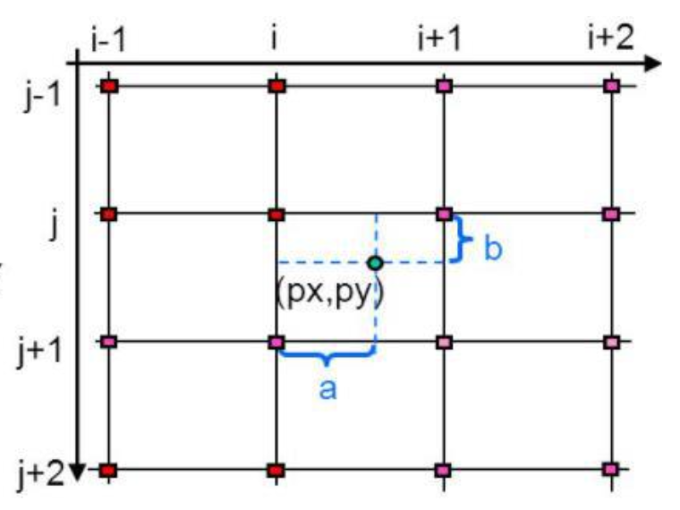
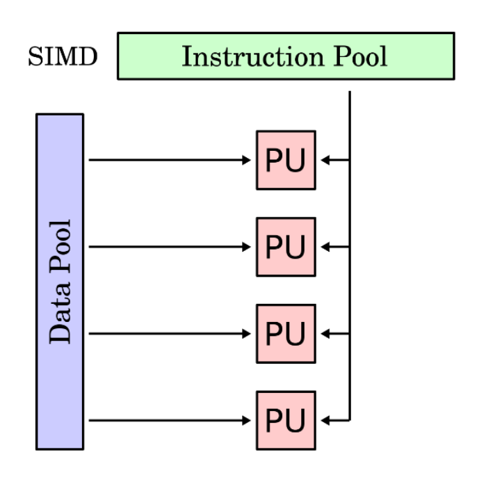

# BICUBIC INTERPOLATION

## 1. Installation and execution

Instalación de la libreria CImg
sudo apt-get install cimg-dev

Compilación del programa
make
(Si desea modificar el factor de escalado únicamente tiene que acceder
al makefile y modificar la variable 'ARG' por el valor deseado, en prácticas
posteriores se planteará cambiar este sistema por uno de lectura de ficheros)

Ejecución del programa
make run

Limpiado de repositorios
make clean

Compresión del proyecto
make zip

## 2. The problem

Image scaling involves enlarging or reducing the physical size of an image by changing the number of pixels it contains. It adjusts the size of the image content and resizes the canvas accordingly.

There are three main algorithms to perform this task: nearest neighbor, bilinear interpolation, and the one we will focus on, bicubic interpolation. To better understand this image interpolation method, we will first explain the other two for clarity.

**Nearest neighbor** is a basic method that requires low processing time. It only considers one pixel, the one closest to the interpolated point. Essentially, it simply enlarges the size of each pixel.

**Bilinear interpolation** takes into account the values of the known pixels surrounding a given one within a 2x2 pixel neighborhood. Once these values are identified, the weighted average of these 4 pixels is calculated to determine the interpolated value. The result is smoother compared to the previous method due to the averaging process, although this requires more processing time.

A step beyond the bilinear case is to consider the neighborhood of the 4x4 nearest known pixels, i.e., a total of 16 pixels. Since these pixels are located at different distances from the unknown-value pixel, greater weight is given in the calculation to those that are closer.

It produces sharper images than the previous two methods. It strikes a good balance between processing time (as it has the highest computational load) and result quality. This is a standard procedure in image editing programs, printer drivers, and camera interpolation.

Bicubic interpolation can be mathematically calculated as follows:

If the values of a function \( f(x) \) and its derivative are known at \( x = 0 \) and \( x = 1 \), the function can be interpolated in the interval \([0,1]\) using a third-degree polynomial. This is known as cubic interpolation. The formula for this polynomial can be easily derived.

#### A Third-Degree Polynomial and Its Derivative:

f(x) = ax^3 + bx^2 + cx + d

f'(x) = 3ax^2 + 2bx + c

#### Values of the Polynomial and Its Derivative at \( x = 0 \) and \( x = 1 \):

f(0) = d, f(1) = a + b + c + d

f'(0) = c, f'(1) = 3a + 2b + c

#### Solving the System of Equations:

These four equations can be written as:

a = 2f(0) - 2f(1) + f'(0) + f'(1)

b = -3f(0) + 3f(1) - 2f'(0) - f'(1)

c = f'(0)

d = f(0)

With this, we have the formula for cubic interpolation.

## 3. Solution

Thanks to the different data structures provided by the CImg library, we store the image "image.png" that is currently in the repository, which will be the one on which we apply the transformations based on bicubic interpolation.

Next, we will also initialize a series of key values for the algorithm’s operation: `scaleFactor` (an integer or decimal value with respect to which our image will be enlarged; for example, if an image is initially 100x100 pixels and we set the scaleFactor to 5, the resulting image will be 500x500 pixels), `width` (the width of the original image), and `height` (the height of the image, expressed in pixels).

After this, we find the initialization of the resulting image, where the scale follows the recently explained dynamics, and the first loop of the program, in which we will only insert the RGB values of the pixels we know in the following way:

At the beginning, we have an image where we know all the pixels (red squares). If we enlarge it, for example, with a scale factor of 2, the number of these pixels increases, leaving us with positions for which we don't know the RGB value (white squares). However, since we know the original values, we can redistribute them across the new image, so we only have to fill in half of the pixels thanks to bicubic interpolation.

As a note, I would like to highlight how the library accesses and inserts RGB values. In the call `imgX(x, y, 0, RGB)`, `x` and `y` refer to the matrix coordinates that will be used. The next function argument is the image depth (which is irrelevant for this exercise, we will always set it to 0), and lastly, the color scale we will consider is `RGB`, which can take 3 values: 0 (red), 1 (green), 2 (blue), since a color is composed of the combination of these values.

## 4. Performance analysis

Next, we will study the variation in performance as the problem load changes, in our case, by increasing the number of enlargements of the original image.

For this, we have used an image of 512x512 pixels, which has been enlarged up to 10 times. Three different processors were used for this test in order to compare the performance across different generations of processors.

It is worth noting that the test was not performed with all the enlargements on the two Intel i7 processors, as the times become unfeasible due to the large increase in the tests, as we will see below.

As shown in the time graph, the higher the number of enlargements, the processing time will increase significantly.

- The most recent processor, the Ryzen 3600x, will have a linear increase in time between tests and will be the fastest at processing all the enlargements.

- i7 7700MQ processor will be the second fastest, although its time increase will be exponential. For this reason, the tests were only performed up to 7 enlargements.

- i7 4702MQ processor was the slowest, as its processing of the algorithm was entirely exponential, becoming three times slower in processing 7 enlargements of the image.
  

## 5. Architecture

The ideal architecture according to Flynn's classification for calculating the inverse matrix through parallelization is SIMD (Single Instruction Stream, Multiple Data Stream). SIMD instruction sets consist of instructions that apply the same operation to a more or less large set of data.

It is an organization where a single common control unit dispatches instructions to different processing units. All of these receive the same instruction but operate on different sets of data. Since we have a problem that can be parallelized at the data level, the operations to be performed on the matrix will always be the same, so we do not need multiple instruction streams. What we need is to divide the input data and assign each one to a different functional unit.

## 6. Bibliography

- **C++ - Bicubic interpolation algorithm for image scaling. (n.d.).** [Stackoverrun](https://stackoverrun.com).
  https://stackoverrun.com/es/q/4115337

- **C++ Image interpolation with Bicubic method. (2016, April 7).** [Stack Overflow](https://stackoverflow.com/questions/36469357/c-image-interpolation-with-bicubic-method).

- **D. (n.d.).** [Resizing Images With Bicubic Interpolation. The blog at the bottom of the sea](https://blog.demofox.org/2015/08/15/resizing-images-with-bicubic-interpolation/).

- **Examples with OpenCV - OpenCV 3.1 with C++ in Visual Studio 2015. (n.d.).** [Learning Programming](http://aprendiendo-programacion.wikidot.com).
  http://aprendiendo-programacion.wikidot.com/ejemplosocv

- **Juan V. Carrillo (jvprofe). (n.d.).** Basic Path Test. White-box testing. [YouTube](https://www.youtube.com/watch?v=GVegCwwfBZ0).

- **Juan V. Carrillo (jvprofe). (2016, May 6).** How to create the flow graph of a program. [YouTube](https://www.youtube.com/watch?v=9N5vPeSWRfQ).

- **makefile - Passing arguments for "execute". (n.d.).** [Stackoverrun](https://stackoverrun.com).
  https://stackoverrun.com/es/q/456475

- **Overall Options (Using the GNU Compiler Collection (GCC)). (n.d.).** [GCC](https://gcc.gnu.org).

- **Profesor Retroman. (2019, November 28).** C++: Compile and link static libraries [Video]. [YouTube](https://www.youtube.com/watch?v=MG8z-k6lH6E&ab_channel=ProfesorRetroman).
